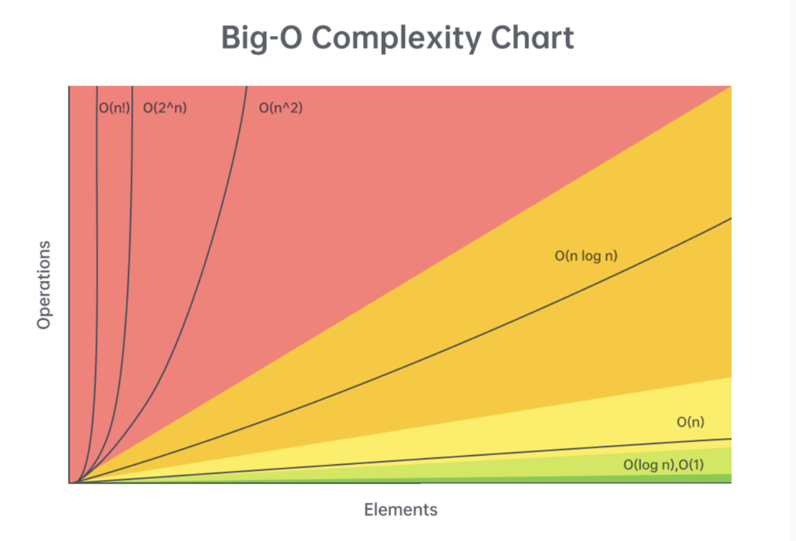

## Algorithms and data structures

This repository is being built for implement the most know problems presented in the code interviews using algorithms and data structures. 

Every problem solution contains the time and space complexity analysis. This is very useful to undestand if the solutions presented are optimal. Below a Big-O complexity chart taken from LeetCode course.

